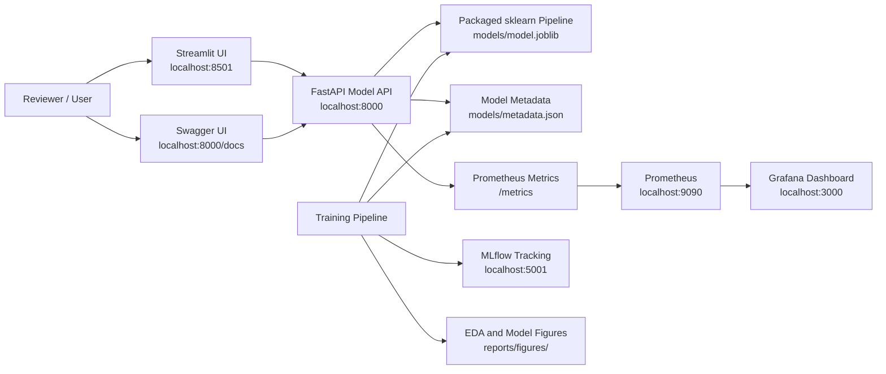
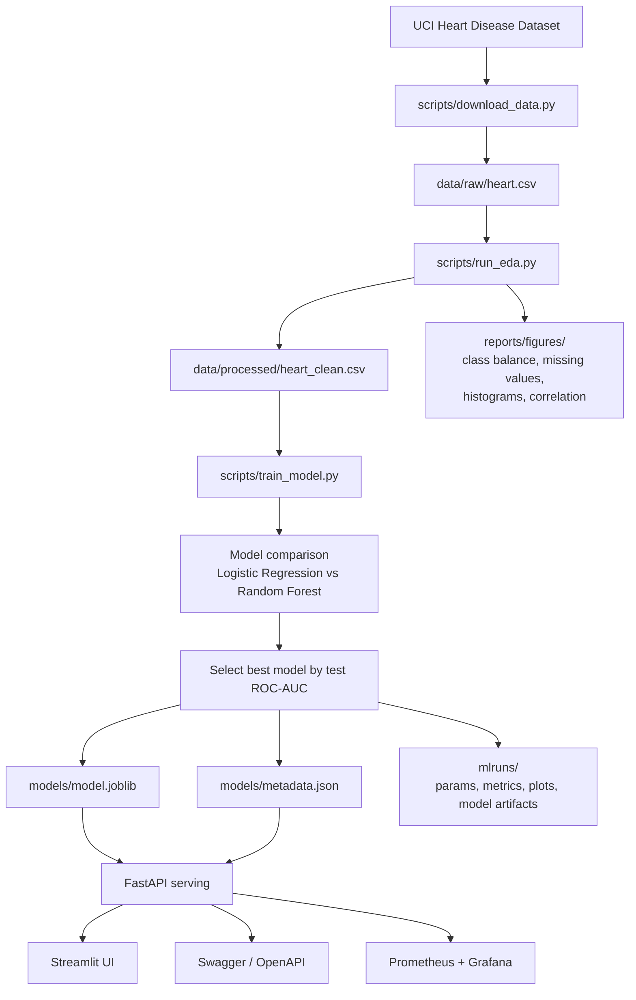
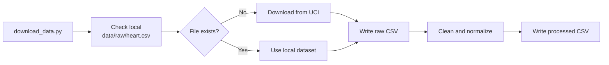
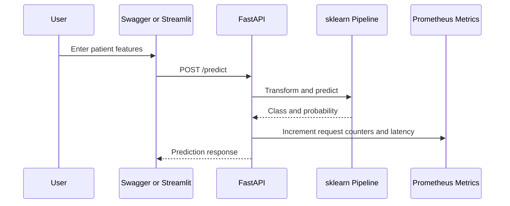
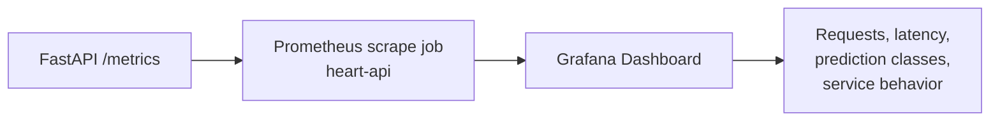
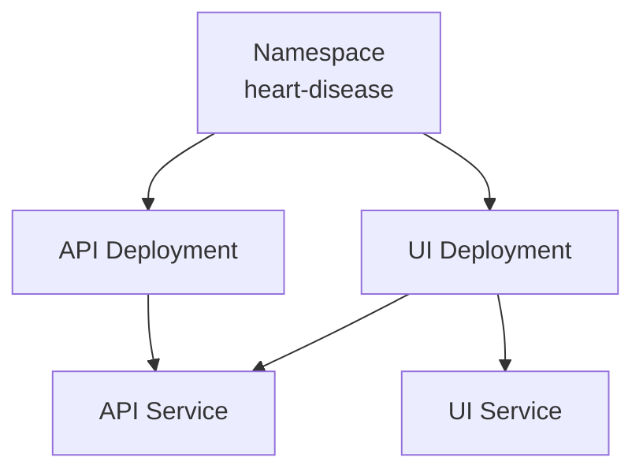
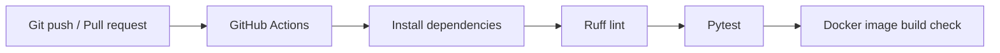

# Heart Disease MLOps Architecture

This document describes the end-to-end architecture of the Heart Disease MLOps Pipeline. It is placed at
the repository root so reviewers can quickly understand how the project is designed, how the services fit
together, and how the pipeline can be executed locally with Docker or Podman.

## 1. Architecture Goals

The system is designed around five assignment goals:

- Reproducible local execution using Python, Docker, or Podman.
- Complete ML lifecycle coverage from data acquisition to model serving.
- Clear experiment tracking and model artifact management with MLflow.
- Human-friendly access through both Swagger and a visual Streamlit UI.
- Runtime observability with Prometheus metrics and Grafana dashboards.

The project avoids notebook-only execution. Every major stage is implemented as Python scripts or reusable
package modules so the same workflow can run locally, in containers, in CI, or in a local Kubernetes
cluster.

## 2. High-Level System View



## 3. End-to-End ML Pipeline

The pipeline is split into deterministic stages. Each stage writes explicit artifacts that are consumed by
the next stage.



## 4. Repository Components

| Area | Path | Purpose |
| --- | --- | --- |
| Python package | `src/heart_disease_mlops/` | Reusable data, feature, training, schema, and API code |
| Data scripts | `scripts/download_data.py`, `scripts/run_eda.py` | Dataset acquisition, cleaning, and EDA |
| Training script | `scripts/train_model.py` | Cross-validation, MLflow logging, model selection, artifact export |
| Bootstrap script | `scripts/bootstrap.py` | Container startup guard that creates missing data/model artifacts |
| API service | `src/heart_disease_mlops/api.py` | FastAPI app with prediction, health, metadata, batch, and metrics endpoints |
| UI service | `ui/streamlit_app.py` | Streamlit dashboard for prediction, metrics, EDA, and pipeline visibility |
| Monitoring | `monitoring/` | Prometheus scrape config and Grafana dashboard provisioning |
| Containerization | `Dockerfile`, `compose.yaml` | Docker/Podman local runtime |
| Kubernetes | `k8s/` | Local deployment manifests for API and UI |
| Tests | `tests/` | Unit and API tests |
| Evidence | `reports/screenshots/`, `docs/final_report.pdf` | Runtime evidence and final assignment report |

## 5. Data Layer

The dataset layer is intentionally simple and reproducible.



Important decisions:

- The raw CSV is included for immediate review.
- The script checks locally first, then downloads only if missing.
- Missing markers such as `?` are normalized.
- The original multi-class target is converted to a binary target:
  - `0`: no heart disease
  - `1`: heart disease present

## 6. Modeling Layer

The selected artifact is a full scikit-learn pipeline, not only a classifier. This keeps preprocessing and
inference consistent.

```text
Pipeline
  ColumnTransformer
    Numeric columns
      SimpleImputer(strategy="median")
      StandardScaler()
    Categorical columns
      SimpleImputer(strategy="most_frequent")
      OneHotEncoder(handle_unknown="ignore")
  Estimator
    Logistic Regression or Random Forest
```

Training behavior:

- Uses stratified train/test split.
- Uses stratified cross-validation on the training split.
- Tracks Logistic Regression and Random Forest candidates.
- Logs metrics to MLflow: accuracy, precision, recall, and ROC-AUC.
- Selects the final model by test ROC-AUC.
- Saves model and metadata to `models/`.

The latest included model selected Logistic Regression with strong ROC-AUC and recall, making it suitable
for the assignment's binary health-risk screening demonstration.

## 7. Serving Layer

FastAPI provides the serving boundary for the trained model.



API endpoints:

- `GET /health`: service and model availability.
- `GET /model-info`: selected model metadata and metrics.
- `POST /predict`: one patient prediction.
- `POST /batch-predict`: multiple patient predictions.
- `GET /metrics`: Prometheus metrics endpoint.
- `GET /docs`: Swagger UI generated from OpenAPI.

## 8. UI Layer

The Streamlit UI is a reviewer-friendly layer over the API. It does not duplicate model logic. Instead, it
calls the FastAPI service and displays the response.

The UI shows:

- API health and model availability.
- Patient input controls.
- Prediction label, probability, and confidence.
- Model metrics and selected model information.
- EDA and evaluation figures.
- Pipeline and service links.

This separation keeps the model-serving contract in one place: FastAPI.

## 9. Observability Layer

Observability is provided with Prometheus and Grafana.



The API exposes metrics for:

- Request count by endpoint.
- Prediction count by predicted class.
- Prediction latency.

Prometheus scrapes the API, and Grafana visualizes the metrics through the provisioned dashboard in
`monitoring/grafana/dashboards/heart_api_dashboard.json`.

## 10. Container Runtime

`compose.yaml` starts the complete local stack:

| Service | Host Port | Purpose |
| --- | ---: | --- |
| `api` | `8000` | FastAPI model serving and Swagger |
| `ui` | `8501` | Streamlit visual UI |
| `mlflow` | `5001` | MLflow experiment tracking UI |
| `prometheus` | `9090` | Metrics scraping |
| `grafana` | `3000` | Monitoring dashboard |

MLflow uses host port `5001` to avoid common macOS conflicts on port `5000`. Inside the container, MLflow
still runs on port `5000`.

The API container runs `scripts/bootstrap.py` before starting FastAPI. This means:

- If the dataset exists locally, it is reused.
- If the dataset is missing, it is downloaded.
- If processed data or figures are missing, EDA is regenerated.
- If the model is missing, training is executed.

## 11. Kubernetes View

The `k8s/` folder contains local Kubernetes manifests for the API and UI.



The manifests are intentionally lightweight for local review in Minikube, Kind, or Docker Desktop
Kubernetes. The Compose stack is the easiest path for full local review because it also starts MLflow,
Prometheus, and Grafana.

## 12. CI/CD View

GitHub Actions is configured in `.github/workflows/ci.yml`.



The CI workflow validates the code quality and core tests before the repository is submitted or extended.

## 13. Local Execution Summary

Python-only path:

```bash
python3 -m venv .venv
source .venv/bin/activate
pip install -r requirements.txt
pip install -e .
python scripts/download_data.py
python scripts/run_eda.py
python scripts/train_model.py
uvicorn heart_disease_mlops.api:app --host 0.0.0.0 --port 8000
```

Docker path:

```bash
docker compose up --build
```

Podman path:

```bash
podman-compose -f compose.yaml up --build
```

## 14. Key Design Decisions

- Use scripts and package modules instead of notebooks for repeatability.
- Commit small assignment artifacts such as CSVs, model files, MLflow runs, figures, and screenshots so
  evaluation does not depend on re-running every step.
- Keep preprocessing inside the saved model pipeline to avoid training-serving mismatch.
- Expose Swagger for direct API testing.
- Add Streamlit for visual interaction and demonstration.
- Add Prometheus/Grafana for operational visibility.
- Keep Kubernetes manifests simple and local-cluster friendly.
