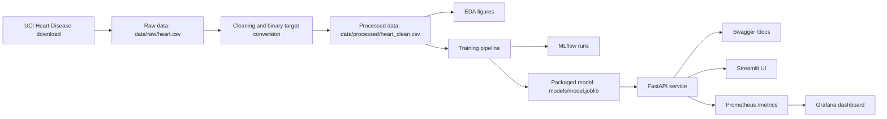

# Architecture

## Local Flow



## Containers

`compose.yaml` starts five services:

- `api`: bootstraps data/model if needed and serves FastAPI.
- `ui`: Streamlit visual dashboard.
- `mlflow`: experiment tracking UI.
- `prometheus`: scrapes `/metrics` from the API.
- `grafana`: displays the API dashboard.

## Model Reproducibility

The saved model is a single scikit-learn pipeline:

```text
ColumnTransformer
  numeric: median imputation + standard scaling
  categorical: most frequent imputation + one-hot encoding
Estimator
  Logistic Regression or Random Forest
```

Saving the full pipeline ensures the same transformations are applied during training and serving.

